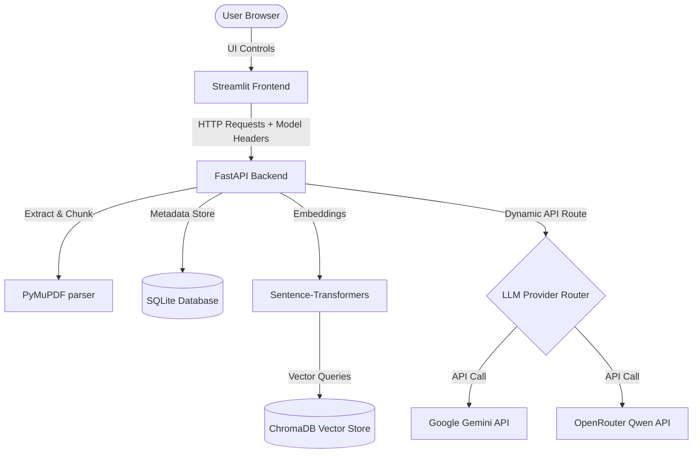

# AI Research Assistant

A lightweight, RAG (Retrieval-Augmented Generation) powered web application designed to help researchers parse, search, summarize, and compare academic papers. Built using Python, FastAPI, SQLite, ChromaDB, and Streamlit, it supports dynamic on-the-fly model switching between Google Gemini and OpenRouter Qwen.

---

## Key Features

*   **PDF Ingestion & Processing**: Extracts raw text from academic PDFs, splits documents into semantic chunks, and creates vector embeddings.
*   **Vector Search & RAG**: Utilizes a local ChromaDB instance to perform semantic searches and retrieve context-relevant excerpts to answer user queries.
*   **Dynamic LLM Routing**: Features a runtime model configuration toggle to switch between **Google Gemini (2.5 Flash)** and **OpenRouter Qwen (2.5 72B)** dynamically without restarting the server.
*   **Structured Summarization**: Generates map-reduce summaries of papers by analyzing section-level context, optimizing for API rate limits and quotas.
*   **Multi-Paper Comparative Analysis**: Compares multiple research papers simultaneously along customizable comparison axes (methodology, findings, contributions).
*   **Session-Based User Isolation**: Generates a unique browser session UUID for each visitor. All uploaded papers, metadata, and vector database embeddings are isolated per session, ensuring visitors can only view, query, and manage their own files.
*   **Academic Editorial UI**: Streamlit interface designed with clean, dark/light theme-aware, Times New Roman typography to mimic academic publications.

---

## System Architecture



---

## Tech Stack

*   **Frontend**: Streamlit, Custom CSS (Academic typography)
*   **Backend**: FastAPI (Python), Uvicorn
*   **Database**: SQLAlchemy, SQLite (via `aiosqlite`)
*   **Vector Store**: ChromaDB, `sentence-transformers` (all-MiniLM-L6-v2)
*   **PDF Parser**: PyMuPDF (`fitz`)

---

## Local Setup

### 1. Prerequisites
- Python 3.10+ installed.

### 2. Installation
1. Clone the repository and navigate into it:
   ```bash
   git clone https://github.com/yourusername/your-repo-name.git
   cd "AI Assitant"
   ```
2. Create and activate a Python virtual environment:
   ```bash
   python -m venv venv
   venv\Scripts\activate
   ```
3. Install dependencies:
   - For **local development & offline testing** (includes PyTorch/SentenceTransformers):
     ```bash
     pip install -r requirements-dev.txt
     ```
   - For **production deployment** (lightweight, uses API-based embeddings, excludes PyTorch):
     ```bash
     pip install -r requirements.txt
     ```

### 3. Environment Variables
Create a `.env` file in the root directory:
```ini
OLLAMA_HOST=http://localhost:11434
LLM_PROVIDER=gemini
LLM_MODEL=gemini-2.5-flash-lite
CHROMA_PERSIST_DIR=./chroma_db
UPLOAD_DIR=./uploads
DATABASE_URL=sqlite+aiosqlite:///./papers.db
EMBEDDING_MODEL=all-MiniLM-L6-v2
CHUNK_SIZE=512
CHUNK_OVERLAP=64

# Add your API Keys
GEMINI_API_KEY=your_gemini_api_key
OPENROUTER_API_KEY=your_openrouter_api_key
```

### 4. Running the Application
*   **Terminal 1 (Backend)**:
    ```bash
    venv\Scripts\uvicorn app.main:app --reload --port 8000
    ```
*   **Terminal 2 (Frontend)**:
    ```bash
    venv\Scripts\streamlit.exe run streamlit_app.py --server.port 8501
    ```
